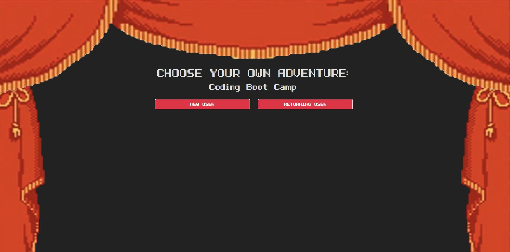

# CYOA

A Choose Your Own Adventure game with a coding boot camp theme.  We wanted to create a basic text-based game where users could create an account complete with password and input validation.  The game would consist of a series of questions, where the user's answer to the question would determine how their score and stress levels change, indicated by gauges.

## Deployed Application:
https://cyoa-bc.herokuapp.com/

## Presentation
https://docs.google.com/presentation/d/1XN0RQEjUMF6HD9x8cIKy_Av5s_HEhqDan5qWo6zUXkc/edit?usp=sharing

## Technologies
* HTML
* CSS
* Bootstrap
* Javascript
* jQuery
* Node.js
* Express.js
* Express-validate
* Sequelize.js
* bcryptjs
* MySQL
* Heroku
* JawsDB
* Gauge.js

## Screenshots

## Contributors
* Ashlen Bruns (ashlenbruns)
* Scott Anderson (ScottTAnderson)
* Bryan Bloomquist (bryanbloomquist)
* John Evans (evanjo03)
* Steve Thompson (sthmpsn)
